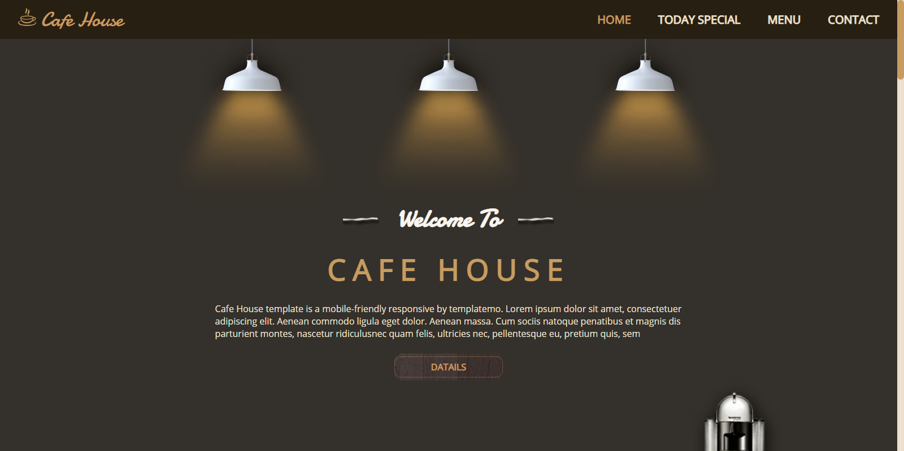
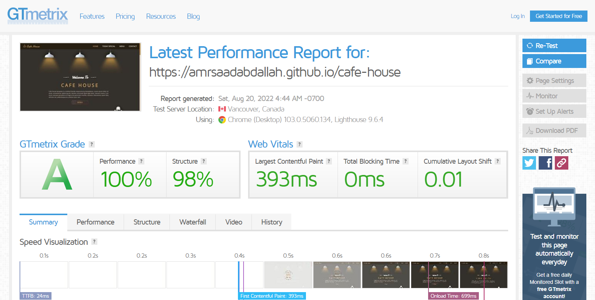

<h1 align="center">  Cafe House Template </h1>

### 👁️ Project Preview:

- [ Live Preview 👉 https://amrsaadabdallah.github.io/cafe-house](https://amrsaadabdallah.github.io/cafe-house)

- [ Github Repo 👉 https://github.com/amrsaadabdallah/my-cafe-house](https://github.com/amrsaadabdallah/my-cafe-house)
    - 🚩 It's a private repo <a target="_blank" href="mailto:amrsaadabdallah@gmail.com">contact me </a>to see.

---

### 📝 Project Description & features:

- It's a Multi page project used to practice HTML5, CSS3, SASS, Vanilla JS.
- It consists of 3 pages (Home, Today Special,  Menu, Contact) .

---

### 🛠️ Project Tools:

1. SASS.

1. IcoMoon for providing a packages of vector icons.

1. ParcelJS a Bundler Tool.

1. [Squoosh](https://squoosh.app/) is an online tool for image compression web app that reduces image sizes through numerous formats.

1. [GTmetrix](https://gtmetrix.com/) is an online tool for customers to easily test the performance of their webpages.

---

### :sparkles: Project Skills applied:

1. Link fonts (Damion, Open Sans) internally.

1. Used IcoMoon provides a package of vector icons, along with a free HTML5 app for making custom icon fonts or SVG sprites.

1. Practice CSS preprocessor (SASS) features like adding nested rules, variables, mixins, selector inheritance, and more.

1. Applied Desktop first technique to create a responsive web app.

1. Write Vanilla JavaScript to create a dynamic web app, EX:

   - Preloader functionality
   - navbar toggler buttom functionality
   - Handle smooth scrolling in internal navigation
   - Update Current year functionality
   - Handle scroll to top button functionality

1. Bundle project by using Parceljs.

1. Compression images using Squoosh tool.

1. Test the performance of the webpage after deploy by using [GTmetrix](https://gtmetrix.com/).

---

### 🧪 Project performance test:

Test the performance of the webpage after deploy by using [GTmetrix](https://gtmetrix.com/).

---

### 📚 Resources:

- This template is a clone of [cafe house template](https://templatemo.com/live/templatemo_466_cafe_house) that Built by [template mo](http://www.templatemo.com/).

---

### 👋 Get In Touch:

- [🌐 Website 👉 https://amrsaadabdallah.github.io](https://amrsaadabdallah.github.io)
- [👔 LinkedIn 👉 https://www.linkedin.com/in/amrsaadabdallah](https://www.linkedin.com/in/amrsaadabdallah)
- [🌟 Github 👉 https://github.com/amrsaadabdallah](https://github.com/amrsaadabdallah)
- [📧 Gmail 👉 amrsaadabdallah@gmail.com](mailto:amrsaadabdallah@gmail.com)
- [🐤 Twitter 👉 https://twitter.com/amrsaadabdallah](https://twitter.com/amrsaadabdallah)
- [:phone: Whatsapp 👉 (+20) 109-775-6067](https://api.whatsapp.com/send/?phone=%2B2001097756067&text&type=phone_number&app_absent=0)

---

<a target="_blank" href="https://amrsaadabdallah.github.io">

 2022 &copy; Amr Saad Abdallah 

</a>

